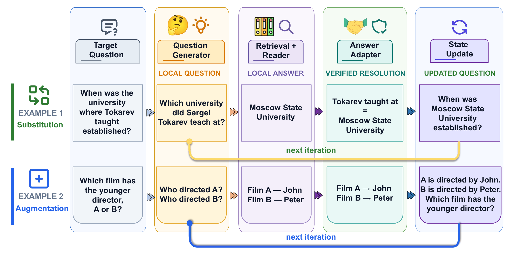
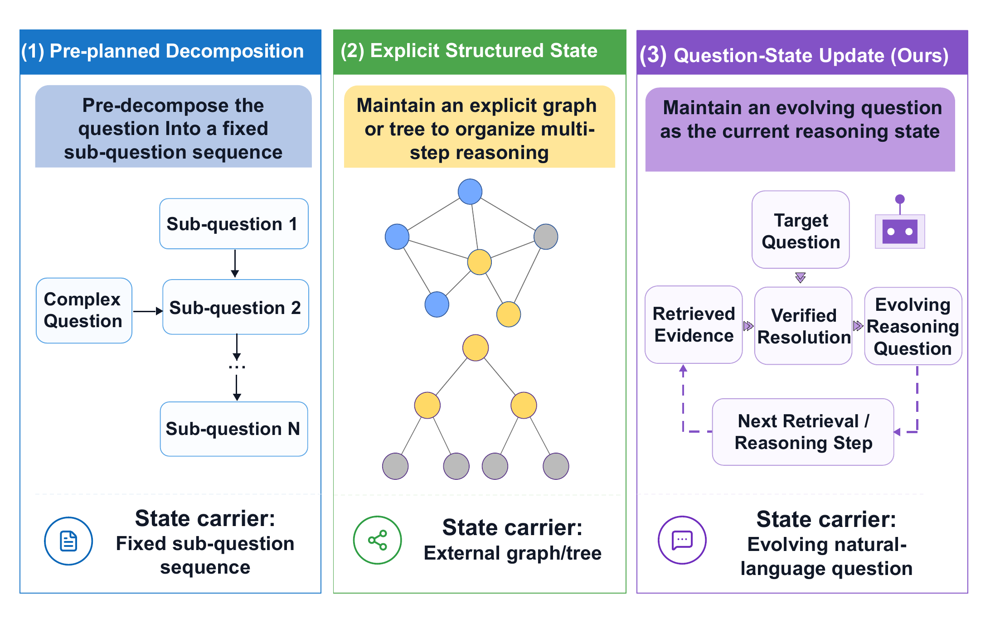
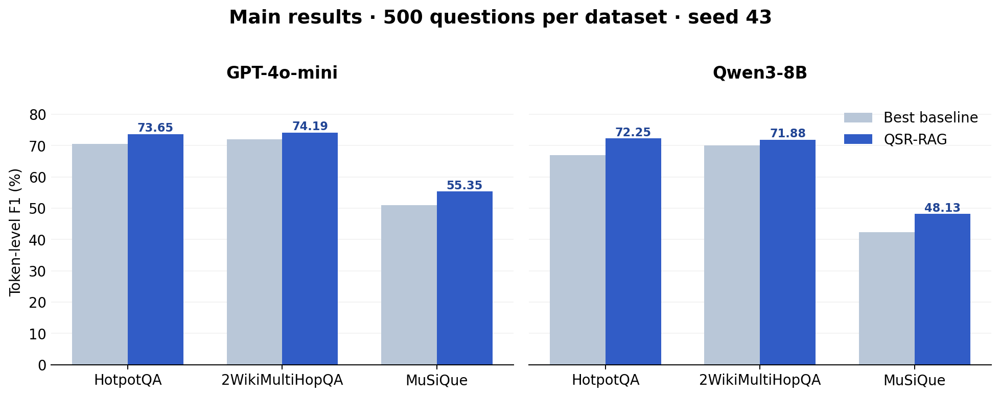

<div align="center">

# QSR-RAG

### Let the question evolve with verified evidence

**Question-State Rewriting for Multi-Hop Retrieval-Augmented Generation**

[Chinese paper (PDF)](paper/qsr_rag_acl.pdf) · [LaTeX source](paper/qsr_rag_acl.tex) · [Reproduce](#reproduce-the-main-experiments) · [Results](#main-results)

</div>

> **Release scope.** This repository contains the full QSR-RAG path for the paper's main experiments: three datasets, two backbone models, fixed lists of 500 questions, and one shared dense retrieval setup. Scores for comparison methods are reported for context; their separate implementations are outside the scope of this release.



## Contents

- [The idea](#the-idea)
- [Main results](#main-results)
- [Reproduce the main experiments](#reproduce-the-main-experiments)
- [Outputs and verification](#outputs-and-verification)
- [Repository layout and paper](#repository-layout-and-paper)

## The idea

A multi-hop question cannot usually be solved with one retrieval call. As evidence arrives, a system needs to decide both **what to retrieve next** and **how to express the remaining task**. QSR-RAG treats these as different kinds of state:

| Object | Purpose | Lifetime |
| --- | --- | --- |
| Target question $Q^{(0)}$ | Anchors the original task and final answer space | Fixed throughout |
| Reasoning question $Q^{(t)}$ | Expresses the complete task at the current step | Updated across rounds |
| Verified resolution memory $M^{(t)}$ | Stores intermediate facts supported by direct evidence | Accumulates across rounds |
| Local question $q^{(t)}$ | Drives one retrieval action | Used within a round |

In each round, the system generates a local question, retrieves evidence, and reads a local answer. An **answer adapter** checks whether that answer resolves the intended target and whether the evidence directly supports the relation. Accepted facts enter memory. The state updater then uses one of two operations:

1. **Substitution.** Insert a resolved hidden entity into the reasoning question. Once the evidence establishes that Tokarev taught at Moscow State University, “When was the university where Tokarev taught established?” can become “When was Moscow State University established?”
2. **Augmentation.** Add verified facts as premises when a direct substitution would change the candidates or answer space, as can happen in comparison, selection, and Boolean questions.

The updated reasoning question guides the next round, while the original target question remains fixed for the final answer. The system allows at most **four rounds** and **two independent local questions per round**. The paper also examines a failure case in which a rewrite changes the intended relation.



## Main results

The table below reproduces the main results from the [Chinese paper](paper/qsr_rag_acl.pdf). Each dataset uses **500 development-set questions** selected with **seed 43**. EM is answer exact match; F1 is token-level answer F1. All values are percentages.

| Backbone | Dataset | QSR-RAG EM | QSR-RAG F1 | Best comparison F1 |
| :--- | :--- | ---: | ---: | ---: |
| GPT-4o-mini | HotpotQA | **57.60** | **73.65** | 70.47 |
| GPT-4o-mini | 2WikiMultiHopQA | **64.80** | **74.19** | 72.08 |
| GPT-4o-mini | MuSiQue | **42.00** | **55.35** | 51.02 |
| Qwen3-8B (non-thinking) | HotpotQA | **57.40** | **72.25** | 66.98 |
| Qwen3-8B (non-thinking) | 2WikiMultiHopQA | **62.60** | **71.88** | 69.99 |
| Qwen3-8B (non-thinking) | MuSiQue | **35.20** | **48.13** | 42.24 |



QSR-RAG achieves the highest EM and F1 in all six settings. Averaged over the six settings, it exceeds the strongest comparison method in each setting by **4.63 EM points** and **3.78 F1 points**. With GPT-4o-mini, its mean F1 across the three datasets is **67.73**, using an average of **20.47k tokens per question**. These are controlled comparisons under the paper's shared retrieval backend; they should not be compared directly with leaderboard scores produced using different corpora or retrievers. Regenerate the chart with `python scripts/plot_main_results.py`.

## Reproduce the main experiments

Run the commands below from the repository root. **Python 3.10+** is recommended. The complete six-setting run requires three development sets, two retrieval models, and working Chat Completions-compatible endpoints for both backbone models. Runtime and API cost depend on your hardware and providers. Start with five questions to check the environment, then run the full 500-question settings. Progress is saved under `outputs/`.

### 1. Install dependencies

On Windows PowerShell:

```powershell
python -m venv .venv
.\.venv\Scripts\Activate.ps1
python -m pip install -r requirements.txt
```

On Linux or macOS, activate the environment with `source .venv/bin/activate`.

### 2. Obtain the development sets

| Dataset | Official source | Expected path |
| --- | --- | --- |
| HotpotQA distractor dev | [HotpotQA downloads](https://hotpotqa.github.io/) | `data/raw/hotpotqa/hotpot_dev_distractor_v1.json` |
| 2WikiMultiHopQA dev | [Official 2WikiMultiHopQA repository](https://github.com/Alab-NII/2wikimultihop) | First place `dev.json` at `data/raw/2wikimultihopqa/dev.json` |
| MuSiQue-Ans dev | [Official MuSiQue repository](https://github.com/stonybrooknlp/musique) | `data/raw/musique/musique_ans_v1.0_dev.jsonl` |

After placing the official 2Wiki `dev.json` file, convert it to the expected Parquet path. The converter preserves the original example order:

```powershell
python scripts/prepare_2wiki.py
```

The development-set indexes used in the paper contain **66,581 / 56,686 / 21,098** distinct documents for HotpotQA / 2WikiMultiHopQA / MuSiQue, respectively. The `manifests/` directory contains only the **500 question IDs and their order** for each main-result setting, not the benchmark data. When using a mirror or a different release, check the IDs, order, and data format. Parquet files written by different library versions may have different hashes even when their rows match.

<details>
<summary>SHA-256 hashes of the data files used for the local paper runs</summary>

| File | SHA-256 |
| --- | --- |
| `hotpot_dev_distractor_v1.json` | `E3DA074DF24E8369009918AA5CDBDD254DADCDE4C63F7569D36AFD6F2268CAA8` |
| `dev.parquet` | `C0D8B60B9026B728FB07AD74C5252A0F188F6942E8BA5C02DF4DFA369502EA8D` |
| `musique_ans_v1.0_dev.jsonl` | `15FA63794D18A94CE12411ACA6E2327E65B6E83B0B1490EFAB3F1962E48ABF3B` |

</details>

### 3. Download retrieval models and build indexes

The paper uses [BGE-M3](https://huggingface.co/BAAI/bge-m3) for dense encoding and [bge-reranker-v2-m3](https://huggingface.co/BAAI/bge-reranker-v2-m3) for reranking. These commands download them to the paths expected by the code:

```powershell
python -c "from huggingface_hub import snapshot_download; snapshot_download('BAAI/bge-m3', local_dir='models/bge-m3')"
python -c "from huggingface_hub import snapshot_download; snapshot_download('BAAI/bge-reranker-v2-m3', local_dir='models/bge-reranker-v2-m3')"
python prepare_indexes.py
```

Each index is built from the union of documents in the **entire development set**, not just the selected 500 questions. Each retrieval call uses BGE-M3 + FAISS dense top-200 → document reranking to top-60 → radius-1 sentence windows with reranking → top-20 windows. Generated indexes remain in `indexes/` and are excluded from Git.

### 4. Configure the language models

Copy the template and adjust model names or endpoint URLs for your providers. API keys are read from environment variables; `config.json` is ignored by Git:

```powershell
Copy-Item config.example.json config.json
$env:OPENAI_API_KEY = "your GPT-4o-mini API key"
$env:DASHSCOPE_API_KEY = "your Qwen3-8B API key"
```

The Qwen3-8B entry in `config.example.json` sets `enable_thinking: false`. Within each setting, the same backbone serves all four stages: local-question generation, local reading, answer adaptation, and state updating. If running only one backbone, configure only its key.

### 5. Run the six main settings

```powershell
# Check one setting with five questions first:
python reproduce.py --models gpt4o_mini --datasets hotpotqa --num-questions 5

# Run 3 datasets × 2 backbones, 500 questions per setting:
python reproduce.py
```

Use `--models` and `--datasets` to run a subset, for example `python reproduce.py --models qwen3_8b_non_thinking --datasets musique`. Repeating the same command resumes from saved per-question results; the five-question run can also be extended to 500 questions without discarding its output. Provider failures, model revisions, numerical precision, and inference environments can produce small differences from the paper's scores.

## Outputs and verification

Each setting produces:

```text
outputs/main/<model-config-name>/<dataset>/
├── <dataset>_<model-config-name>_seed43_details.jsonl  # Per-question answers, evidence, traces, EM/F1
└── <dataset>_<model-config-name>_seed43_summary.json  # Aggregate EM/F1 and usage metrics
```

The summary's `em` and `f1` values are **fractions from 0 to 1**; multiply by 100 to compare them with the table. Also check `completed_questions = 500`, `retrieval.policy_compliant = true`, and that the detail-file question IDs match `manifests/<dataset>_seed43_500.jsonl` in order. Questions that still fail after retries remain in the denominator and receive EM/F1 = 0.

## Repository layout and paper

```text
QSR-RAG/
├── README.md                     # English project overview and reproduction guide
├── reproduce.py                  # Entry point for the six main settings
├── prepare_indexes.py            # Dense indexes for the full development sets
├── config.example.json           # Model configuration template without credentials
├── manifests/                   # Fixed question-ID order for the paper's main table
├── data/                        # Dataset parsers; download raw data separately
├── retriever/                   # Retrieval, reading, adaptation, and state updates
├── scripts/                     # Main evaluation and preprocessing tools
├── assets/                      # Figures displayed on the GitHub landing page
└── paper/                       # Chinese ACL-style PDF, LaTeX, bibliography, vector figures
```

The [Chinese paper PDF](paper/qsr_rag_acl.pdf) is an anonymous-review manuscript. Its [LaTeX source](paper/qsr_rag_acl.tex) can be compiled with XeLaTeX → BibTeX → XeLaTeX twice. The paper includes additional analyses, ablations, and a failure case; the runnable release focuses on the six main settings above. Formal citation details will be added after publication. Until then, please cite the paper title and this repository.
